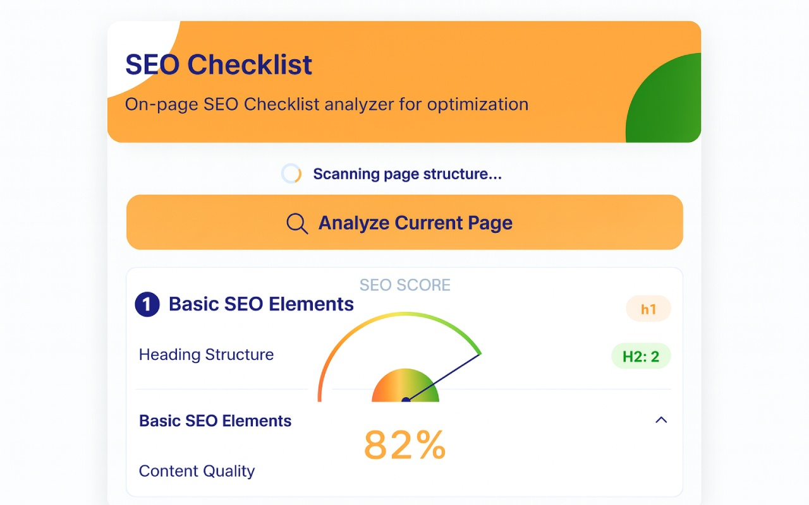
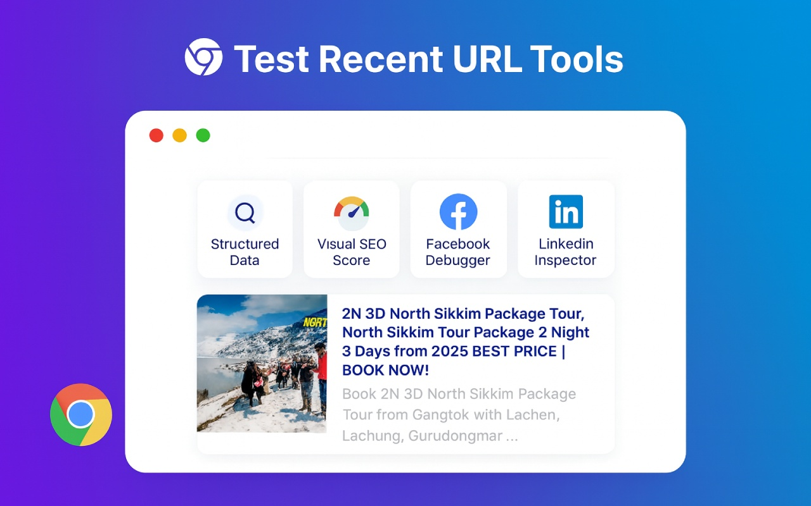
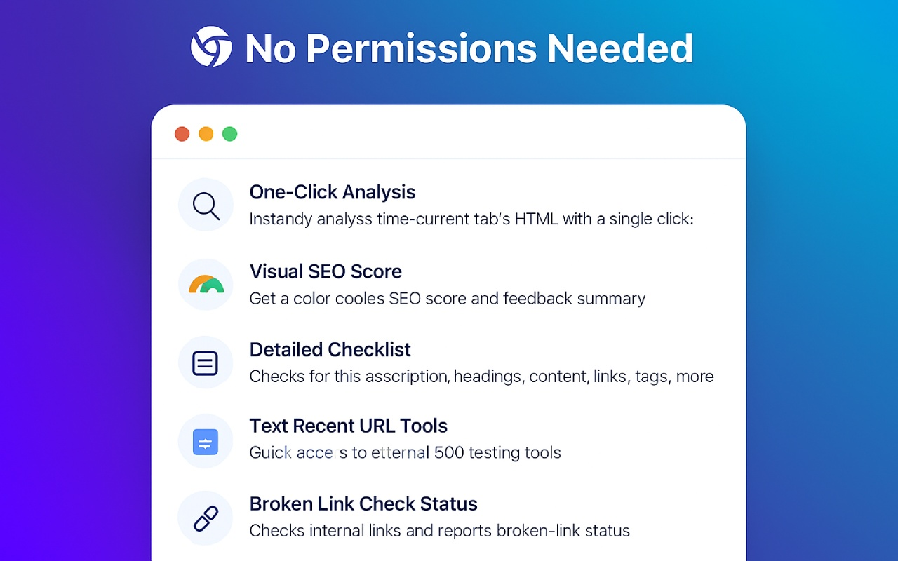

# SEO Checklist v1.3 – On-Page SEO Analyzer Chrome Extension

SEO Checklist is a modern, privacy-friendly Chrome extension that provides instant, client-side on-page SEO analysis for any website you visit. It gives you a clear, actionable checklist and visual feedback to help you optimize your pages for search engines—no server, no data collection, no permissions beyond what’s needed.

---

## Install from Chrome Web Store

[**Install SEO Checklist from the Chrome Web Store**](https://chromewebstore.google.com/detail/seo-checklist/jgigdhidhmgikfnccdnehcpgoggmagfh?hl=en-GB&authuser=0)

---

## What’s New in v1.3 (March 2026)

- **Social Preview Analyzer**: Instantly preview Open Graph and Twitter-style title, description, image, and URL metadata.
- **Quick SEO Testing Tool Launcher**: Open Rich Results Test, PageSpeed Insights, Facebook Sharing Debugger, and LinkedIn Post Inspector with one click.
- **Broken Link Visibility**: Better internal-link quality checks with status feedback in the popup.
- **Performance + Workflow Benefits**:
  - Reduce manual QA time for technical SEO checks.
  - Catch metadata and sharing-preview issues before publishing.
  - Validate on-page SEO and off-page sharing readiness from one extension.

---

## Features

- **No Permissions Needed Beyond Active Tab**: All analysis is performed client-side. No data leaves your browser.
- **One-Click Analysis**: Instantly analyze the current tab’s HTML with a single click.
- **Visual SEO Score**: Get a color-coded SEO score and feedback summary.
- **Detailed Checklist**: Checks for:
  - Title tag length (50–60 chars)
  - Meta description length (120–160 chars)
  - Heading structure (1 H1, multiple H2s)
  - Content length (500+ words)
  - Image alt texts
  - Internal links
  - Mobile viewport tag
  - Canonical tag
  - Schema markup
  - Google Analytics / GA Tag implementation
- **Color-Coded Status**: Good, Warning, and Needs Work indicators for each check.
- **Tooltips**: Hover for actual content and recommendations.
- **Accordion UI**: Expand/collapse categories for a clean, modern look.
- **Loading Indicator**: See when analysis is running.
- **Google Analytics Detection**: Detects if Google Analytics or Google Tag Manager is installed on your page
- **Social Preview Card**: Preview social metadata (title, description, image, URL) directly in the extension popup.
- **Broken Link Check Status**: Checks internal links and reports broken-link status for faster technical cleanup.
- **Test Recent URL Tools**: Quick access to external SEO testing tools:
  - **Structured Data / Rich Results** – Test with Google's Rich Result Testing Tool
  - **Google PageSpeed Insights** – Analyze page performance and loading speed
  - **Facebook Sharing Debugger** – Preview how your page appears when shared on Facebook
  - **LinkedIn Post Inspector** – Preview how your page appears when shared on LinkedIn
  - Each tool opens in a new tab with your current page URL automatically pre-filled
- **Works on Most Pages**: (Not available on Chrome Web Store, extensions, or `chrome://` pages due to browser restrictions.)

---


## Manual Installation (Development)

1. **Clone or Download this Repository**
2. **Open Chrome and go to** `chrome://extensions/`
3. **Enable "Developer mode"** (top right)
4. **Click "Load unpacked"** and select the extension folder (containing `manifest.json`)

---

## Usage

1. Visit any website you want to analyze.
2. Click the SEO Checklist extension icon in your Chrome toolbar.
3. Choose your action:
   - **Analyze Current Page** – Perform a detailed on-page SEO analysis with scoring and checklist
   - **Test Recent URL** – Use external SEO tools to test your page:
     - Click **Structured Data** to test rich snippets and schema markup with Google's tool
     - Click **PageSpeed Insights** to check performance metrics and optimization suggestions
     - Click **Facebook Debugger** to preview page sharing appearance on Facebook
     - Click **LinkedIn Inspector** to preview page sharing appearance on LinkedIn
4. View your SEO score, checklist, and detailed results instantly, or check external tool results in a new tab.

---

## Screenshots

<p align="center">
  
  
  
  
  
</p>

---

## How It Works

- Uses the [Chrome Extensions Manifest V3](https://developer.chrome.com/docs/extensions/mv3/intro/) API.
- Injects a script into the active tab to fetch the page’s HTML.
- Parses and analyzes the HTML in the popup—**no data is sent anywhere**.
- Displays results in a modern, interactive UI.

---

## File & Folder Structure for Chrome Web Store Upload

Only include the following files/folders in your upload ZIP:

```
SEO Checklist/
│   LICENSE
│   manifest.json
│   popup.html
│   popup.js
│   README.md*
│
└───icons
  icon16.png
  icon48.png
  icon128.png
```

Do **not** include `marketing/` or `screenshots/` folders in the upload ZIP. Upload screenshots and promo images separately in the Chrome Web Store dashboard.

---

### Key Files

- **manifest.json** – Extension configuration and permissions
- **popup.html** – Extension popup UI
- **popup.js** – Main logic for fetching and analyzing the page
- **icons/** – Extension icons

### Permissions

```json
"permissions": [
  "scripting",
  "activeTab"
],
"host_permissions": [
  "<all_urls>"
]
```

---

## Limitations

- **Cannot analyze Chrome Web Store, extensions, or `chrome://` pages** (browser security restriction).
- **Some sites may block script injection** (e.g., with CSP headers).
- **SEO checks are basic and for guidance only**—always combine with manual review and other tools.

---

## Privacy

SEO Checklist does **not** collect, store, or transmit any data. All analysis is performed locally in your browser.

---

## License

MIT License

---

## Credits

- UI inspired by modern design aspects.
- Built with [Chrome Extensions API](https://developer.chrome.com/docs/extensions/).

- **Developer:** [Anupam Mondal](https://anupammondal.in)


